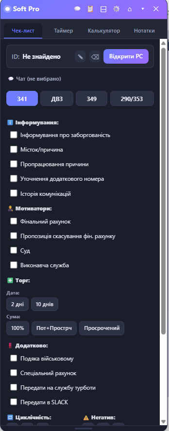
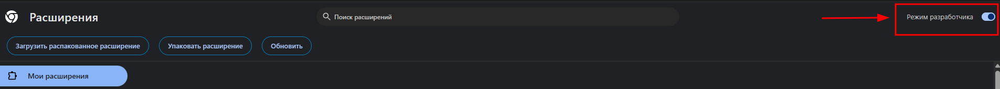
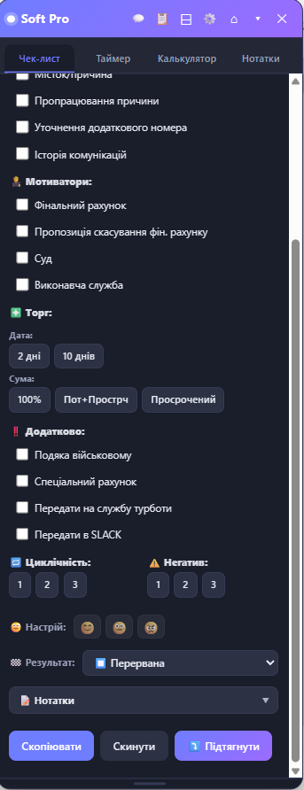
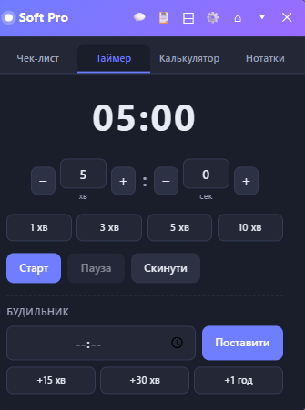
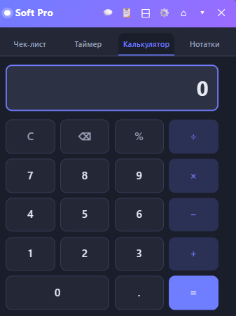
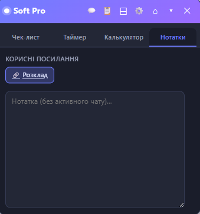
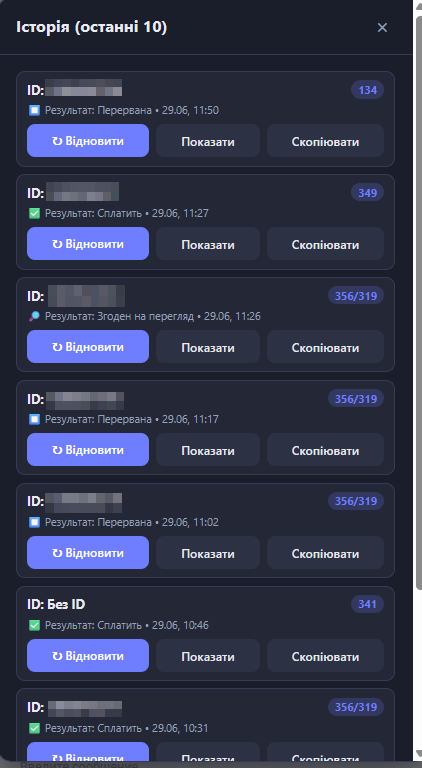
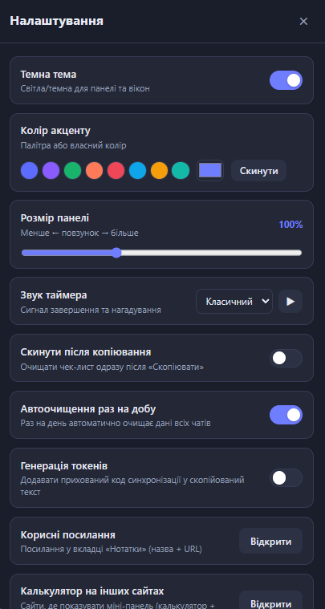
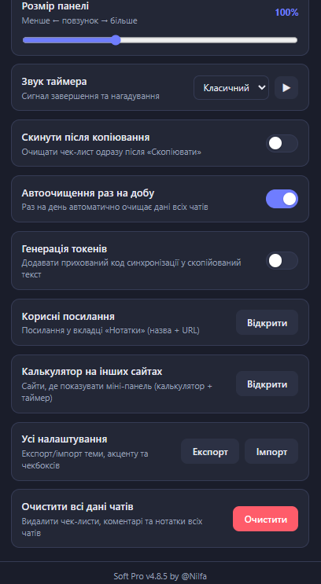

# Soft Pro

<p align="center">
  
</p>

<p align="center">
  <b>Робоча панель оператора для <code>chat.sender.ftband.net</code></b><br>
  Чек-лист за подіями, таймер, калькулятор і нотатки — прямо на сторінці чату.
</p>

<p align="center">
  
  
  
</p>

<p align="center">
  <a href="CHANGELOG.md">📜 Список змін (CHANGELOG)</a>
</p>

<p align="center">
  
</p>

---

## Що це

**Soft Pro** — розширення для Chrome/Edge, яке додає плаваючу панель на сторінку
корпоративного чату `chat.sender.ftband.net`. Воно допомагає оператору вести розмову
за чек-листом, формувати готовий текст для копіювання, відстежувати час і робити
нотатки — усе зберігається **окремо для кожного чату**. Працює незалежно від Sender Pro
і не конфліктує з ним.

---

## 🚀 Встановлення (покроково)

> Розширення не з Chrome Web Store, тож ставиться вручну в «режимі розробника». Це
> робиться один раз і займає ~1 хвилину.

**1. Завантажте файли.**
На сторінці репозиторію натисніть зелену кнопку **Code → Download ZIP**
(або візьміть `soft-pro-X.Y.Z.zip` з розділу [Releases](../../releases)).
Розпакуйте архів у будь-яку постійну папку (не видаляйте її потім —
розширення працює з неї).

**2. Відкрийте сторінку розширень.**
У Chrome введіть в адресному рядку `chrome://extensions`
(у Edge — `edge://extensions`) і натисніть Enter.

**3. Увімкніть «Режим розробника».**
Перемикач **Developer mode / Режим розробника** — у правому верхньому куті.

<p align="center">
  
</p>

**4. Завантажте розпаковане.**
Натисніть **Load unpacked / Завантажити розпаковане** (кнопка ліворуч на тій самій
панелі) і виберіть папку, де лежить файл `manifest.json` (коренева папка розпакованого
розширення).

**5. Готово.**
Відкрийте (або оновіть) `chat.sender.ftband.net` — панель **Soft Pro** з'явиться
у правому верхньому куті сторінки.

> **Оновлення версії:** завантажте нову версію, розпакуйте поверх старої папки
> (або в нову й оберіть її), потім на `chrome://extensions` натисніть кнопку
> оновлення (⟳) на картці Soft Pro. Налаштування та дані чатів зберігаються.

---

## 🧭 Як користуватись

Панель має шапку з кнопками та чотири вкладки: **Чек-лист**, **Таймер**,
**Калькулятор**, **Нотатки**.

### Шапка панелі

| Кнопка | Дія |
|---|---|
| 💬 / 📞 | Перемикач **Чат / Телефонія** |
| 📋 | **Історія** останніх кейсів |
| ⊟ / ⊞ | **Компактний** режим (згорнути) |
| ⚙️ | **Налаштування** |
| ⌂ | Повернути панель на місце |
| ▾ | Згорнути вміст |
| ✕ | Сховати панель (повертається кнопкою **SP**) |

### Вкладка «Чек-лист»

<p align="center">
  
  
</p>
<p align="center"><i>Зліва — верхня частина (ID, події, кроки), справа — нижня (настрій, результат, кнопки).</i></p>

1. **ID + «Відкрити РС».** Угорі — ID клієнта (визначається автоматично зі сторінки)
   та кнопка відкриття робочого столу. ID можна редагувати ✎ чи очистити ⌫.
2. **Подія.** Кнопки **341 / ДВЗ / 349 / 290-353** перемикають профіль кроків.
   Подія **визначається автоматично** з картки клієнта за кодом (напр. `K00134` → ДВЗ 134);
   за потреби її завжди можна змінити вручну.
3. **Кроки.** Відмічайте пройдені пункти за блоками (Інформування, Мотиватори, Торг,
   Циклічність, Негатив, Додатково). У «Торг» вибір по одному (Дата/Сума), у ДВЗ — вибір
   місяців та умови ДВЗ (погодився/відмовився).
4. **Настрій** (😊/😐/😠) і **Результат комунікації** — внизу.
5. **Нотатки** — згортний блок для коментаря.
6. **Скопіювати** формує структурований текст (Результат, Настрій, Пройдені кроки,
   Залишилось), **Скинути** — очищає поточний кейс (перед очищенням він іде в Історію).

### Вкладка «Таймер»

<p align="center">
  
</p>

Хвилини/секунди (зі швидкими кнопками), звуковий сигнал і **Будильник** на конкретний
час. Таймер **глобальний і фоновий** — працює, навіть коли вкладка неактивна чи браузер
згорнутий, і однаковий на всіх сторінках.

### Вкладка «Калькулятор»

<p align="center">
  
</p>

Звичайний калькулятор: миша + повна підтримка клавіатури
(`0-9 . , + - * / = Enter Backspace Esc %`).

### Вкладка «Нотатки»

<p align="center">
  
</p>

Окрема нотатка під кожен чат + блок **«Корисні посилання»** (кнопки-посилання,
налаштовуються в ⚙️).

### Історія (📋)

<p align="center">
  
</p>

Останні 10 кейсів (один запис на клієнта за CID). Кейс потрапляє сюди при «Скинути»
та при переході на інший чат. Кнопки: **↻ Відновити**, **Показати** (повний текст),
**Скопіювати**. Історія очищається раз на добу разом із даними чатів.

### Налаштування (⚙️)

<p align="center">
  
  
</p>
<p align="center"><i>Зліва — верхня частина, справа — нижня (прокрутка вниз).</i></p>

Тема (світла/темна), колір акценту, розмір панелі, звук таймера, скидання після
копіювання, автоочищення раз на добу, генерація токенів, корисні посилання,
«Калькулятор/Таймер на інших сайтах», очищення всіх даних, експорт/імпорт.

---

## ✨ Можливості (стисло)

| Вкладка | Опис |
|---|---|
| **Чек-лист** | Профілі за подіями (341 / ДВЗ 356-319, 134, 327 / 349 / 290-353) з кроками, групами та віджетами; автовизначення події за K-кодом; настрій, результат, згортні нотатки; режим Чат/Телефонія. |
| **Таймер** | Хв/сек, швидкі кнопки, звук, будильник; глобальний фоновий таймер, синхронний між сторінками. |
| **Калькулятор** | Миша + клавіатура. |
| **Нотатки** | Нотатка під кожен чат + корисні посилання. |

Додатково: світла/темна тема, акцент, зміна висоти (на чек-листі), компактний режим,
авто-визначення ID, історія, експорт/імпорт, автоочищення раз на добу, міні-панель
(калькулятор+таймер) на інших сайтах за списком.

---

## 📂 Структура

```
manifest.json        — маніфест розширення (MV3)
css/alliance.css     — стилі панелі (світла/темна тема, адаптив)
js/
  storage.js         — сховище (localStorage, налаштування, історія)
  theme.js           — тема, акцент, масштаб
  draggable.js       — перетягування панелі
  operatordesk.js    — ID клієнта + «Відкрити РС»
  calculator.js      — калькулятор, таймер, будильник
  notes.js           — нотатки під чат
  checklist.js       — чек-лист, події, формування тексту
  settings.js        — налаштування, історія, модальні вікна
  background.js      — фоновий таймер/будильник (service worker)
  multisite.js       — міні-панель на інших сайтах
  main.js            — побудова панелі, вкладки, перемикання чатів
icons/               — іконки розширення
docs/                — документація та скріншоти
```

> Скріншоти в гайді — у папці [`docs/img/`](docs/img). Покладіть туди зображення
> панелі (без даних клієнта) з відповідними іменами — вони підхопляться в README.
